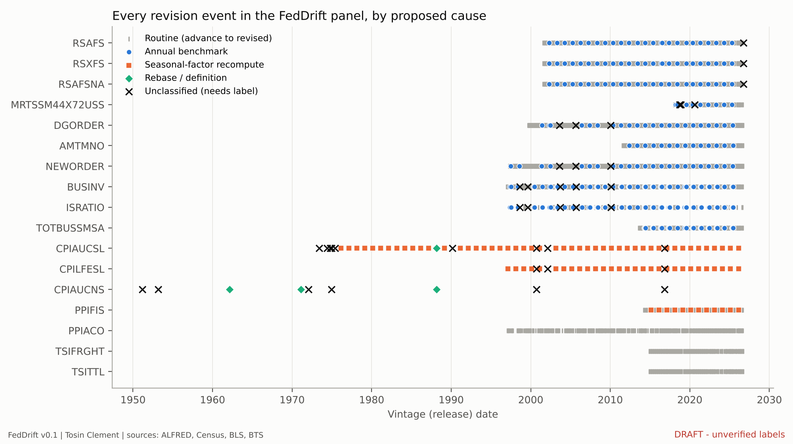
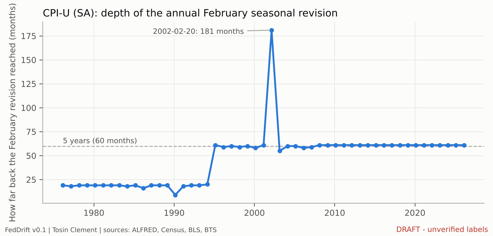
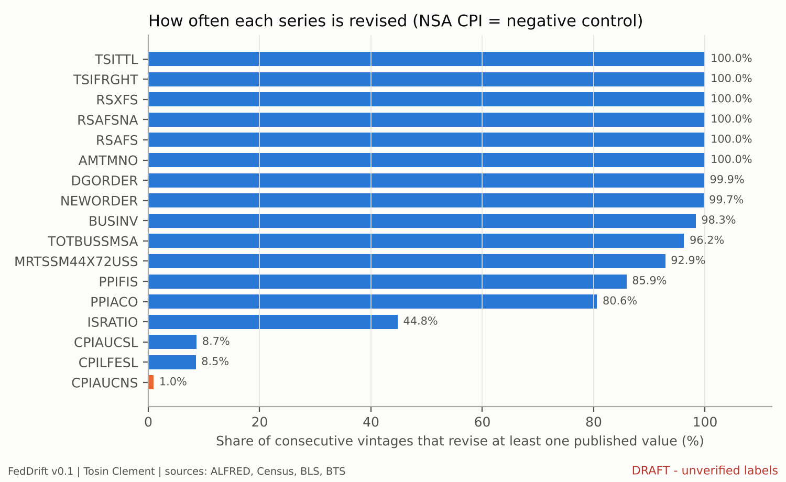
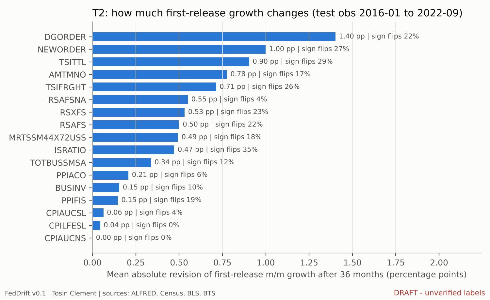

> **DRAFT v0.1, not verified.** Revision-event causes are rule-engine proposals until the label owner verifies each one against agency methodology. Do not cite.

## Abstract

[VERIFY: author to rewrite in her own voice.] Official statistics change after publication. Advance estimates are revised, annual surveys are benchmarked, seasonal factors are re-estimated, and indexes are rebased. Each change shifts the distribution that downstream models were trained on. FedDrift turns these shifts into a labeled benchmark. It covers 17 monthly series from the Census Bureau (MARTS, MRTS, M3, MTIS), the Bureau of Labor Statistics (CPI, PPI) and the Bureau of Transportation Statistics (TSI). From 6,312 real-time vintages it derives 6,295 consecutive vintage pairs, 4,109 of which revise previously published values. Each event carries its government release date, a footprint (depth, breadth, magnitude, and a Kolmogorov-Smirnov shift statistic on growth rates) and a cause label verified against agency methodology. Values are redistributed only for public-domain agency files. The real-time layer is shipped as reconstruction code and hash-verified vintage manifests. Two tasks are defined: revision-cause attribution (T1) and real-time revision correction (T2). On T2, simple bias corrections do not improve on assuming no revision (MAE 0.486 pp vs 0.489 pp).

## 1. Background and motivation
[VERIFY: author section.] Real-time data literature (ALFRED; the Philadelphia Fed Real-Time Data Set for Macroeconomists); distribution shift in machine learning; why government-dated, cause-labeled shift events are a useful test bed.

## 2. Sources and licensing
Agency anchor files (public domain) and ALFRED via the FRED API (not redistributed). See `docs/LICENSING_PROTOCOL.md`. Snapshot date 2026-10-03.

## 3. Construction
Vintage reconstruction from real-time periods; consecutive-pair footprints; rule-engine proposals; author verification workflow (`labels/README.md`).

## 4. Technical validation
- Reconstruction: 0 hash mismatches across 6,312 vintages.
- Anchor agreement: exact for 16/17 series; partial: MRTSSM44X72USS (66.5%), explained in the QA report.
- Negative control: NSA CPI-U revised in 0.97% of releases vs 8.68% (SA CPI-U).
- Named spot checks verified by hand (QA report section 6).

## 5. Data records
`drift_events.csv` and the other files (see `docs/CODEBOOK.md`).

| Cause | Events | Median depth (months) | Median mean abs. revision (%) | Median KS (growth) |
|---|---:|---:|---:|---:|
| `advance_to_revised` | 3,400 | 3 | 0.156 | 0.083 |
| `annual_benchmark` | 309 | 159 | 0.299 | 0.035 |
| `routine_reestimation` | 267 | 237 | 0.111 | 0.019 |
| `seasonal_factor_recompute` | 89 | 60 | 0.057 | 0.083 |
| `unclassified` | 40 | 58 | 0.139 | 0.057 |
| `rebase_or_definition` | 4 | 235 | 42.561 | 0.110 |

## 6. Benchmark tasks and baselines
T1 status: `pending_author_labels`.

T2 (1,352 test observations):

| Baseline | MAE (pp) | RMSE (pp) |
|---|---:|---:|
| B0 no revision | 0.4864 | 0.8687 |
| B1 mean-revision correction | 0.4886 | 0.8699 |
| B2 per-series OLS | 0.4934 | 0.8759 |

## 7. Limitations
See `docs/LIMITATIONS.md`.

## 8. Availability
Code and data: GitHub and Zenodo [DOI]. Code MIT; data CC BY 4.0.

## Author contributions and AI disclosure
Tosin Clement: conceptualization, methodology, validation, data curation (all revision-event labels), writing. Claude (Anthropic) assisted with retrieval and harmonization code and with drafting documentation. The author verified all outputs.

## Figures

